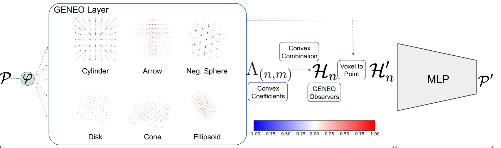

# SCENE-Net V2: Interpretable Multiclass 3D Scene Understanding with Geometric Priors
### Full Paper [here](https://openreview.net/pdf?id=6pKRn6tttu)

## TL;DR
SCENE-Net V2 is an interpretable multiclass 3D scene understanding model that leverages geometric priors. It utilizes Group Equivariant Non-Expansive Operators (GENEOs) to provide transparency and efficiency in 3D semantic segmentation tasks.



## Table of Contents
- [Installation](#installation)
- [Usage](#usage)

## Installation
To install the necessary dependencies for SCENE-Net V2, follow these steps:

1. Clone the repository:
   ```sh
   git clone https://github.com/dlavado/SCENE-Net-V2.git
   cd SCENE-Net-V2
   ```
2. ```pip install -r requirements.txt ```


## Usage

For training:
```
cd scripts
python3 main.py -- model {scenenet, cnn} {--wandb_mode disabled, --wandb_sweep} --dataset $dataset_name
```

For predicting:
```
cd scripts
python3 predict.py -- model {scenenet, cnn} --dataset $dataset_name
```

The values for the ```--model``` and ```--dataset``` flags must constitute an existing subfolder in ```/experiments```
For instance,
```
python3 main.py --model cnn --dataset ts40k
```
Then the following path and file should also exist:
```
root/experiments/cnn_ts40k/defaults_config.yaml
```
where ```defaults_config.yaml``` contains the configuratiions for the current run

Data paths are directly inserted in the ```utils/constants.py``` file;


